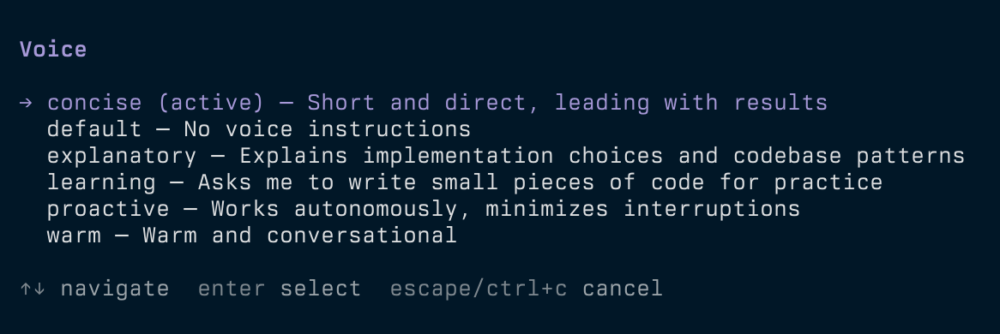

I like how output styles work in Claude Code. I use Concise because I like LLM responses to be straight and to the point. It's easier for me to digest mentally, and shorter responses save output tokens.

I wanted something similar but lightweight in <a href="https://pi.dev" target="_blank" rel="noopener">Pi</a>. So I took a look at how Claude Code implements its styles.

## Looking inside the binary

I told Claude to:

> look in your binary (of Claude Code) and print out the contents of the different output styles. start with concise

And this is the command it ran:

```sh
strings -n 6 /path/to/claude | grep -n "Concise Style Active"
```

That led to a single object in the bundled JavaScript containing the built-in styles. In **v2.1.286**, those were default, Proactive, Concise, Explanatory, and Learning. Default had no prompt. The other four had a name, description, prompt, and a `keepCodingInstructions` flag. Proactive and Concise also had short per-turn reminders.

Concise opened with:

> Keep your responses short and direct while doing the work just as thoroughly.

Its six rule headings were:

- Lead with the result
- Cut narration, keep substance
- Short by default
- State things plainly
- Give full detail on request
- Never trade correctness for brevity

The full Concise prompt was about 10 lines. Learning was closer to 50 and included three examples demonstrating how to pause and ask the user to write a small piece of code.

The style prompt is injected as a meta message in the conversation, headed `# Output Style: <Name>`, and a one-line reminder is repeated each turn. The default first line of the system prompt is `You are an interactive agent that helps users with software engineering tasks`. But with a style active, it becomes `You are an interactive agent that helps users according to your "Output Style", which describes how you should respond to user queries.`

The “Doing tasks” section in the system prompt is gated by `keepCodingInstructions`. The four built-in styles set that flag to true.

## Trying a middle ground

The full style prompts are a bit verbose to append to Pi's system prompt, but just the opening sentences might not be effective. So I made condensed versions that capture the core behavior plus guardrails in 2-3 sentences.

Here's the full <a href="https://github.com/dys-org/pi-voice/blob/v0.3.1/voices/concise.md" target="_blank" rel="noopener">Concise voice file</a>:

```md
---
description: "Short and direct, leading with results"
---

Keep your responses short and direct while doing the work just as thoroughly. Lead with the result; no preamble or closing recap.
Never shorten error output, test failures, security warnings, or confirmations for destructive actions, and answer fully when asked for detail.
```

The part about doing the work thoroughly is important. Asking for shorter answers shouldn't mean losing the details I need when something fails. The second line makes those exceptions explicit, while leaving room for a longer answer when I ask for one.

I'm still testing this. If the shorter versions turn out to be less effective, I can add the rest of the content back.

## Switching voices in Pi

At first, I just copied the Concise voice prompt into `~/.pi/agent/APPEND_SYSTEM.md`, which, as the name implies, <a href="https://pi.dev/docs/latest/configuration" target="_blank" rel="noopener">adds instructions to Pi's system prompt</a>. That works, but the instructions are fixed. I wanted to easily switch styles from the command line.

So I made **pi-voice**. Running `/voice` opens a picker, or you can choose directly with `/voice concise`. It also includes Proactive, Explanatory, and Learning. `/voice default` clears the voice. Your choice is saved across sessions and applies on the next turn.



Voices are Markdown files with YAML frontmatter. You can add your own in `~/.pi/agent/voices/`, and a personal file with the same name overrides a built-in voice. For example, save this as `~/.pi/agent/voices/warm.md`:

```md
---
description: Warm and conversational
---

Use a friendly, conversational tone. Keep explanations clear and avoid excessive enthusiasm.
```

Run `/reload`, then `/voice warm` to select it.

With Pi installed, you can install pi-voice with:

```sh
pi install git:github.com/dys-org/pi-voice@v0.3.1
```

Restart Pi or run `/reload` in your existing session, then try `/voice concise`. The code and voice files are on <a href="https://github.com/dys-org/pi-voice" target="_blank" rel="noopener">GitHub</a>.
