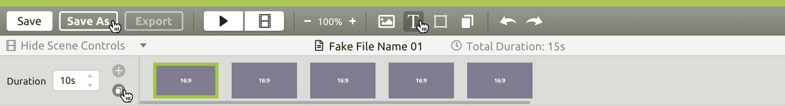
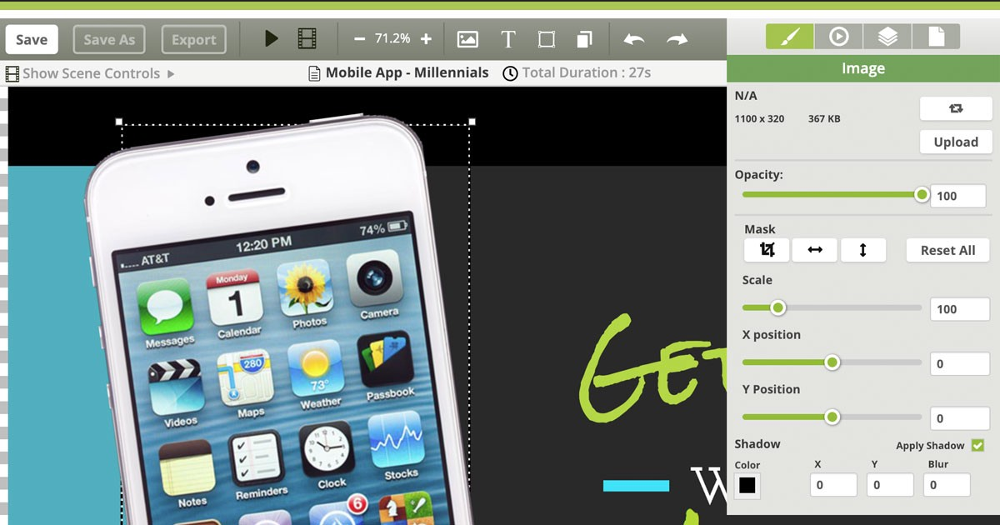

## Background of the Project

**Codigo** is a company that specializes in **Digital Signage** and Kiosk products. The ability to customize existing templates or create your own signage and kiosks from scratch is a feature that sets Codigo apart from their competitors in the market. Customization is done using the browser-based **Content Editor.**

When I started at Codigo in April of 2018, the company was getting ready to start development of a **new and improved digital signage editor.** The existing editor was both powerful and better than anything else on the market, but it was still dependant on jQuery and certain new features were getting hard to implement using the existing codebase. The team had decided to rewrite it using the new hotness, Vue.js.

Although I was never asked to directly, **I saw an opportunity to flex my UX/UI skills and jumped at the chance to design the User Interface for the company’s new flagship product.**

## Research Phase

My first step was of course to do some **research** on the existing product. The fact that my fellow Creative Team members and I spend a good portion of our time creating new templates for the Codigo content vault means that we are in fact _users_ of the Content Editor product. How convenient! I used this situation to my advantage and spent some time **interviewing** my colleagues about their **experiences using the product**, their favorite features, and also their frustrations with the current setup.

During the course of these initial interviews, I discovered that the content editor has essentially **two types of users — designers and non-designers**. The **most challenging part** of designing this product is finding the right **balance** of providing **professional quality features** that designers have come to expect, while also keeping the product **simple enough** for anyone who can put together a basic PowerPoint presentation to use.

> The most challenging part of designing this product is finding the right balance between providing professional quality features that designers have come to expect, while also keeping the product simple enough for anyone who can put together a basic PowerPoint presentation to use.

Having already spoken with the designers, I spent some time interviewing a couple members of the sales team and **had them walk me through how they would create a simple signage piece in the current editor.** The sales team was also able to provide me with some valuable feedback both positive and negative that they had received from customers in the field.

### Competitor Products

The last part of my research phase was to **analyze the competition**. It’s important to “think outside the box” when considering who your competitors are. In this case, I wasn’t aware of any other browser-based digital signage editors at the time, but **I was familiar with several different design tools that provided me with plenty of new ideas and inspiration**. These tools included Photoshop, Illustrator, Invision Studio, Google Web Designer, Keynote and the actual application that I used to create the designs — Sketch.

## Design Phase

Armed with this knowledge, I was ready to **create some mockups**. I fired up Sketch and with the help of my UX Power Tools I created a **library of components** and a style guide using the appropriate brand colors and fonts. I then went about creating the different sections of the UI. I made extensive use of Sketch’s **nested Symbols** feature, the **Anima Layout plugin** for making artboards responsive, and the **Paddy plugin** for creating dynamic buttons. By taking a little extra time at the beginning to set up a library of components, symbols and making them dynamic I was able to concentrate on the creative part of the design and get my ideas onto the screen quickly. Proper setup also makes revisions much easier.

> By taking a little extra time at the beginning to set up a library of components, symbols and making them dynamic I was able to concentrate on the creative part of the design and get my ideas onto the screen quickly.

The **existing editor** consisted of a **sidebar with dropdowns that slowly animate open and closed** according to what is selected on the canvas. Outside of the toolbar the “Play Scene” and “Play All ” buttons are located below the canvas, and the “Zoom In” and “Zoom Out” buttons are above the canvas. The **title of the file** is in a large font at the top of the window that **takes up a lot of screen real estate**. Below that is a row of thumbnails for each Scene in the file. If too many scenes are added the **thumbnails wrap to a second row, which is not ideal**.

## Toolbar

One of the **first major changes** I made to the layout was the addition of a **toolbar** to the top of the window. The Toolbar contains elements that need to be accessible at all times. The buttons for Save, Play, Zoom, Undo/Redo, and adding new elements to the canvas are now all located in **one easily accessible place instead of being spread all around the window**. The **Save and Save As buttons in the current editor** are located along with the controls for setting canvas dimensions, **a section which is rarely accessed by users**, and must to be kept open, **wasting space**, in order to keep the Save buttons accessible.

The **new Save button** also serves as a quick **indicator** of whether **recent changes have been saved** or not. If no changes have been made since the last save the button will appear **green with a check mark**.

Directly under the Toolbar is a small **Title Bar** showing the **name of the file and the total duration in seconds**. To the left of the title is a clickable **“Show Scene Controls”** that reveals the scenes with buttons for adding or duplicating scenes and changing the duration of the highlighted scene. If **more scenes are added then can fit** on the screen a **horizontal scrollbar** is triggered. Being able to Show and Hide the scene controls opens up **valuable screen space for the design canvas**, which is where users spend most of their time.

### Responsive Design

In order to make the new Content Editor usable on both **Desktop and Tablets**, I limited the amount of objects in the toolbar and placed the buttons as far left as possible. This way UI is **responsive** and still usable at a **screen width of 1024px** and slightly below.

## The New Sidebar

Another major change that I made was to the **Sidebar**, which can now also be hidden in order to give more space to the canvas. Instead of organizing sections into slow dropdown menus, **the new Sidebar organizes functionality into four major categories**, the panels for which are quickly and easily accessed using radio buttons. The four sections are Design, Animate, Arrange, and File.

### Design Panel

The **Design panel** still **changes automatically depending on what is selected on the canvas**. The types of elements that can be selected are **Image, Text, or Shape, and Background**. A new feature that was much requested is **numeric inputs for all sliders**, including Scale, X & Y Positions, and Opacity. Often the values for different elements need to be identical and estimating the slider value by hand was not the most precise or practical method.

### Text

The **Text panel** now includes **Font Styles**! Different styles such as Heading 1, or Body Text can be saved and **updated across an entire file with a single click**. Previously each element had to changed individually and the process was quite tedious. A **separate dropdown for font weights** is finally available as well. Both of these features are ones that designers and non-designers alike have come to expect, and I’m very happy to include them in the new editor.

### Images

New features of the **Image panel** include **displaying the original height and width** of the image file and an **improved Mask feature**. An image can now be masked without the need to destructively edit, crop and save a new file.

### Shapes

The new **Shape panel** provides a simplified interface for choosing either a solid fill color or a gradient using checkboxes. Border and drop shadow can also be turned on or off and easily adjusted.

### Backgrounds

The **Background panel** is broken down further into Image, Color, Gradient, and Video also using radio buttons. Improvements to the Video Background panel have been made including a simplified method for setting a start point and looping of video using checkboxes and an input field.

## Animate Panel

Early on **I considered completely rethinking the way the animations in the editor work**. Professional designers and animators have become accustomed to a timeline based GUI for programming animations. After Effects, Google Web Designer, Invision Studio, and the Timeline plugin for Sketch all use timelines. Ultimately though, **the decision was made to stick with the scene by scene, menu-based approach**. This method of programming animations is **much easier to understand for non-designers** and anyone who has ever created a digital slideshow presentation. Much of my inspiration for this aspect of the design came studying Apple’s Keynote interface.

## **Arrange Panel**

Drum roll please… the **Arrange panel** now includes a visual representation of **Layers**! This feature is definitely one designers have come to expect, and one that my research shows non-designers can easily understand with a little education. The old method of **Send to Back** and **Send to Front** is **still available** as well and has been **improved** with buttons for moving **Forward** and **Backward** **one level at a time**.

Another **exciting new feature** for designers are the buttons for **Align** and **Distribute.** This feature, while potentially confusing for non-designers, is an excellent example of the seventh principle of Jakob Nielsen’s 10 Usability Heuristics**.**

> **#7 Flexibility and Efficiency of Use**

> Accelerators — unseen by the novice user — may often speed up the interaction for the expert user such that the system can cater to both inexperienced and experienced users.

> — Jakob Nielsen’s 10 Usability Heuristics

The Align and Distribute function are **a welcome addition for designers** and **non-designers won’t even notice them**. So there should be little confusion.

## **File Panel**

The **File Panel** includes **presets for the Canvas size** and inputs for creating custom canvas sizes. The button for accessing the **Parameters** modal and the checkbox for toggling **Smart Guides** have been moved from under the canvas into this panel as well, giving as much screen real estate to the visual design area as possible.

## Prototype

After **reviewing my designs** with the Creative and Dev team, several revisions were made. The **biggest changes** were **moving the Scene Controls and Play Buttons to the top** and giving the Scenes the ability to be shown or hidden. I originally had all Play and Scene related components at the bottom of the window, much like the timeline in Photoshop. **Putting them at the top opened up more space for the canvas and made more sense organizationally.**

I then linked up Sketch to **Marvel App** using the Marvel Sketch plugin and created a **working prototype** that I not only used to do some **additional testing** but also **handed off to the Dev** team so they could use it for hex codes and measurements.

The Marvel Plugin is fantastic because it allows for **revisions** to be made in Sketch and then quickly pushed up to **the browser-based Prototype**. All links remain intact!

### Check out the interactive prototype below:

If this embed isn’t working please visit [https://marvelapp.com/d8ifdcj](https://marvelapp.com/d8ifdcj)

## **Conclusion**

This product is **still being actively developed**, and I plan to update this article as soon as the MVP is officially released. Below are screenshots of the product on our pilot website. **Muchísimas gracias** to the **Codigo Dev Team** for all of their hard work on this amazing design tool.

If you enjoyed this study, **please hit the clap button.** **You can clap up to 50 times.** Thanks for reading!

