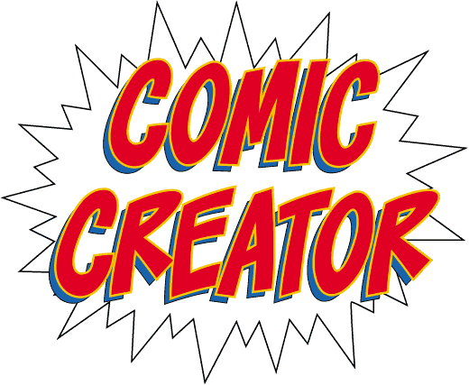

## Introducing the Problem

The first step in creating a page of sequential art is to draw what is called a thumbnail. A thumbnail is a small image that shows the basic panel layout of a page and the general placements of the characters, backgrounds and other important objects within each panel. From there the artist will create a slightly more detailed rough layout, and from the rough layout they will create the finished pencils and eventually the inks.

Determining the panel layout begins at the thumbnail stage and can be a somewhat daunting task. Every creative knows the dreaded feeling of staring at a blank page. The thumbnailing process usually begins in this way. If working from a full script from a writer, the number of panels on a page and their contents will be predetermined. This can be a good starting point. Often though, the artist _is_ the writer or they may be working from the “Marvel method.” In which case the artist will only have a general plot to work from and the layout of the pages will be completely up to them.

## My Solution

Comic Creator is a mobile application that allows users to create page layouts either from scratch or from an existing hand drawn thumbnail or rough layout. Images can be imported from the user’s photo library or directly from Google Images. Creators can choose from various standard panel layouts or they can draw their own panel borders on top of the placed image or images. The opacity of the placed images can be lowered and users can draw or trace as they like on a new layer. The entire file can then be exported as a PSD, JPG, TIFF, or PDF and sent to the cloud or emailed. The exported file can be opened in the creator’s drawing software of choice and finished according to the artist’s preferred workflow using digital tools, traditional tools, or both.

## User Research

Once an idea has been established, the first step in the User Centered Design (UCD) process is to conduct user research. I conducted several interviews and also surveyed potential users. The potential users in this case were professional and amateur cartoonists.

For decades comics were made using pencils, paper, and ink. Many creators still use these tools, but more and more artists are switching to an all digital workflow or a hybrid method of digital and traditional.

> The purpose of this research was to take a closer look at the processes of serious comic creators in 2017 and to identify trends in the tools, both traditional and digital, and methods they were using to create their comic pages and strips.

One of the key findings from my research was that 75% of the creators surveyed and everyone I interviewed said that they used Google Images to locate reference images while drawing. More than half of those surveyed (52.5%) said they use photo reference constantly, and another 42.5% claimed occasional use. **This information led me to incorporate the ability to collect photo reference and a Google Image search function into the app.**

Another useful piece of information is that 80% of those surveyed use standard panel layouts in one way or another. Thirty-five percent use them often, 30% occasionally, and 15% use them as a starting point. These statistics confirmed to me that the ability to pick and edit a standard panel layout was a useful function.

Something that everyone I interviewed agreed on was that the overriding factor in all of their creative work is TIME. Any tool that can speed up their workflow without a noticeable sacrifice in quality is definitely welcome. **This finding emphasized the importance of being able to integrate my app into a user’s current workflow.** Since Photoshop is the industry standard drawing tool, the ability to save or export files in the PSD format would be an important feature.

> Something that everyone I interviewed agreed on was that the overriding factor in all of their creative work is TIME.

## Competitor Analysis

I identified three competitors to my product idea: Strip Designer, Photoshop Sketch, and Clip Studio Paint. Strip Designer and Photoshop Sketch are both mobile applications, while Clip Studio Paint is a desktop application. **These three products have very different capabilities and are targeted at different audiences.**

Strip Designer is the most obvious competitor to my product idea, but it is not made with serious comic creators in mind and cannot easily integrate into a typical creator’s workflow.

Photoshop Sketch, on the other hand, has the exact features that Strip Designer lacks in terms of workflow integration, but it is not tailored specifically to comic creation and therefore does not include the necessary tools and templates.

Clip Studio Paint is in my opinion the best digital application available for serious comic creation because it is essentially a streamlined version of Photoshop made specifically for producing sequential art. However, it’s tools for layout and composition could be improved and it is not supported on mobile devices.

Additionally, I took a closer look at the Strip Designer App and evaluated it using Nielson’s 10 Usability Heuristics. I found positive instances of principles 3 and 5, but negative instances of principle 6 as well as other shortcomings.

## Empathy Maps & Personas

In order to gain a deeper understanding of my users, I created three distinct personas using the information I gathered during interviews and from my survey. Although each persona was eventually depicted as a single person they were created by combining the characteristics and behaviors of many people.

To help bridge the gap between the personas and my design concepts, I also created an empathy map for each persona. The empathy maps helped me to consider what and how my potential users are thinking and feeling.

> It was important to focus on my user’s behaviors and goals when creating the personas. Demographics such as age, race and gender were secondary concerns or not considered at all.

## Lean UX and MVP

Embracing the Lean UX process, my next step was to create an MVP (Minimum Viable Product). Lean UX is less focused on deliverables than traditional UX, and **the core idea is to get feedback from users as soon as possible.** I chose 6 key features that my product needed in order to satisfy my users and provide valuable feedback.

**Key Features**

- Create a new page
- Add multiple layers
- Place images on the page
- Search Google Images
- Add a panel layout
- Export as a PSD file

## User Stories

With these key features in mind I created 28 different User Stories in the form of, “As a user I want to \_\_\_\_, so that I can \_\_\_\_. “

## Content Strategy

Using the same 28 actions from the “As a user I want to \_\_\_” column of my user stories I conducted a card sort. I chose to conduct my card sort in person using actual printed cards instead of using an online tool. I attended one of the weekly Drink and Draws hosted by the Louisville Cartoonist Society and quickly found three qualified volunteers to participate in the card sort. By conducting the card sort in person I was able to converse with them after they completed the initial task and some of the most valuable information that I took from this activity came through those conversations.

Two of the participants, Zach and Alex, created very similar groupings. The third participant, Lori, used a slightly different method when creating the groups, but similar terminology can be seen in the group names given by all three. **I made sure to keep these groupings and labels in mind when I began wireframing and creating the design flows for the application.** This practice helped to ensure that the interface would be intuitive and familiar to the users.

> By conducting the card sort in person I was able to converse with the participants after they completed the initial task and some of the most valuable information that I took from this activity came through those conversations.

Zach, who I had interviewed during my initial research phase was happy to see that I was incorporating reference images into the design. His opinion was welcome encouragement that I was on the right track.

## User Flows

At this point I was eager to jump into Sketch and start designing some screens, but first I needed to give some thought to the structure and flow of the pages. **Taking the time to consider my user’s objectives before I began the visual design process, ultimately helped me to create a better product.** I sketched out my user flows first by hand on notebook paper and then created a more polished version in Illustrator.

## Wireframes

If you look closely at my first user flow sketch you can see that I drew some very rough wireframes of the screens for my app, which I was now officially calling Comic Creator. The name had at first only been a placeholder, but since the double use of the letter C looked and sounded good, and the name also described the application well, I decided to use it.

Using graph paper, grayscale Copic markers, and black ink pens I created detailed sketches of my user interface. I used Post-It notes (a UX Designer’s best friend) to simulate the pop-up screens and some of the panels on the canvas. **Sketching on paper eliminated any temptation to tinker with typefaces, colors or graphics.** My main focus at this stage was on optimizing the navigation and defining the basic hierarchy of elements for each page.

## Prototype

Next I created a clickable prototype from my sketches and Post-Its using Marvel App (not in any way associated with Marvel Comics). I created some additional screens by copy-pasting parts of different sketches together and adding details in Photoshop. For example, all of the images of boats were added to the Google search page by lassoing the hand drawn empty boxes and filling them with images from Pixabay and the panel borders and gutters were added to another screenshot by drawing thin white boxes with a black stroke.

I also made a couple changes based on feedback received from fellow designers.

> One of the best suggestions given was very simple and in hindsight seems obvious. It was to move the Add New Layer button in the Layers panel farther away from the Delete Layer button. This simple movement helped to avoid a crucial mis-tap that could have been very annoying to users.

Once the changes and alterations were made I created the interactions in Marvel using PNG files exported from Photoshop. The ability to combine my analog sketches with the functionality of a digital tool like Marvel App is extremely useful (not to mention convenient) and I plan to use this method for future projects as well.

Take a look at my rough prototype <a href="https://marvelapp.com/976hh79/screen/30642282" target="_blank">here</a>.

## Usability Testing

I made the decision to test Comic Creator as a lofi wireframe because as Steve Krug says in his highly regarded book _Don’t Make Me Think_, **“Testing one user early on in the project is better than testing 50 near the end.”**

There is no doubt that good visual design can improve the usability of a product, but if the design of an interface works as a rough sketch, adding visual design elements will only enhance the user experience. However, **if the interface does not work in lofi, pretty colors and typography cannot save it.**

The usability test was held at a local coffee shop. The participants were members of the Louisville Cartoonist Society. I conducted the test using the mockup iPad from Marvel App on my Surface Pro in tablet mode.

Users were asked to complete four short tasks, and all three participants were able to do so with little or no help. My first user was a Freddie type persona, while the other two were closer to a Chuck persona. The four tasks were:

1.  Create a new standard size comic book page.
2.  On a new layer, add a photo from Google Images.
3.  Also on a new layer, add a panel grid layout.
4.  Export your document to Dropbox as a PSD file.

> If the design of an interface works as a rough sketch, adding quality visual design elements can only enhance the user experience.

Overall the usability testing was a success and **we were able to identify several small issues that could be improved in the next iteration.** Improvements made as a direct result of the usability testing include:

- The add new button on the Pages screen was labeled “Create New”
- The option to create your own page size was added
- Panel grids are now referred to as Panel Layouts

The plus sign icon on the Pages screen was apparently not as obvious as I had thought, and it needed to be labeled. The button was labeled in my initial wireframe sketches, but I had removed it for aesthetic purposes and because I thought it was redundant. Testing confirmed that the label was necessary after all.

Page sizes for comics are fairly standardized, especially in the U.S., yet they do vary slightly from publisher to publisher, whereas web comics and strip cans vary quite a bit. The ability to create a custom canvas size eliminated any problems caused by the limits of the available choices.

Referring to a group of panels on a page as a panel layout instead of a panel grid keeps this feature from being confused with the composition and perspective grids.

## Visual Design

Now that I had a realistic understanding of the needs of my users and had tested my interface with real potential users, it was finally time to open Sketch and do some visual designing.

In order to keep the focus on the art being created, I chose a very subdued and unobtrusive color scheme for my interface. I used shades of gray with medium blue accents and buttons. **Bright, saturated colors would have been distracting.**

The font family I chose for the Comic Creator interface is **Trade Gothic Next.** I mostly used the Light weight, but some of the menu titles use Regular Condensed. Trade Gothic is a classic grotesque sans-serif. Like many of the older Gothic style typefaces it has a number of irregularities that give it a slightly more playful feel than later grotesques, such as Helvetica. These qualities made it an appropriate choice for the UI of a comic layout app.

### Style Sheet

### Logo

For the Comic Creator logo, I chose a hand-lettered comic style font with bold primary colors. **The same primary color scheme is traditionally used for superheroes in comic books, so it seemed quite appropriate.** The blue used in the drop shadow of the logo is the same blue used throughout the interface.

Try version 2.0 of my prototype here:

If interactive is not working please visit [https://marvelapp.com/j042cag/screen/31046557](https://marvelapp.com/j042cag/screen/31046557)

This case study was part of my capstone project for the Springboard UX Design course. Highly recommended.

That’s all for now! Thanks for your time.

\-DYS
