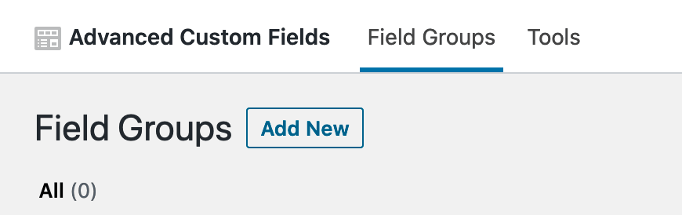
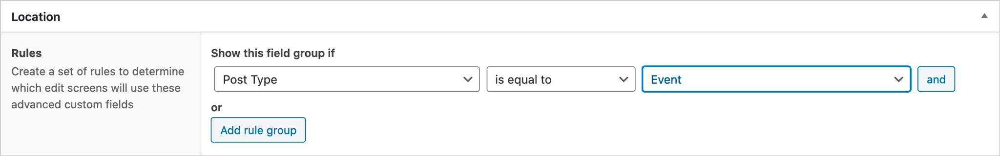
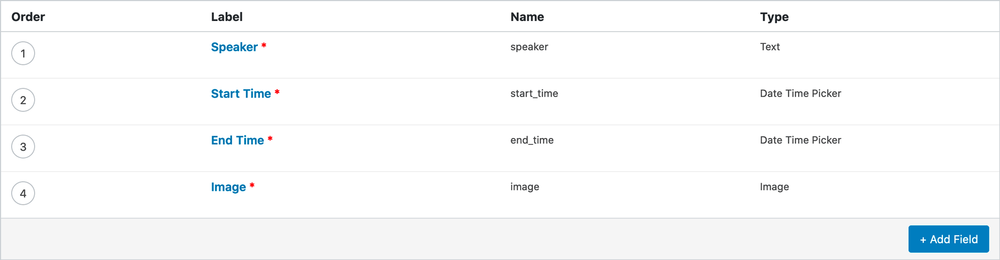
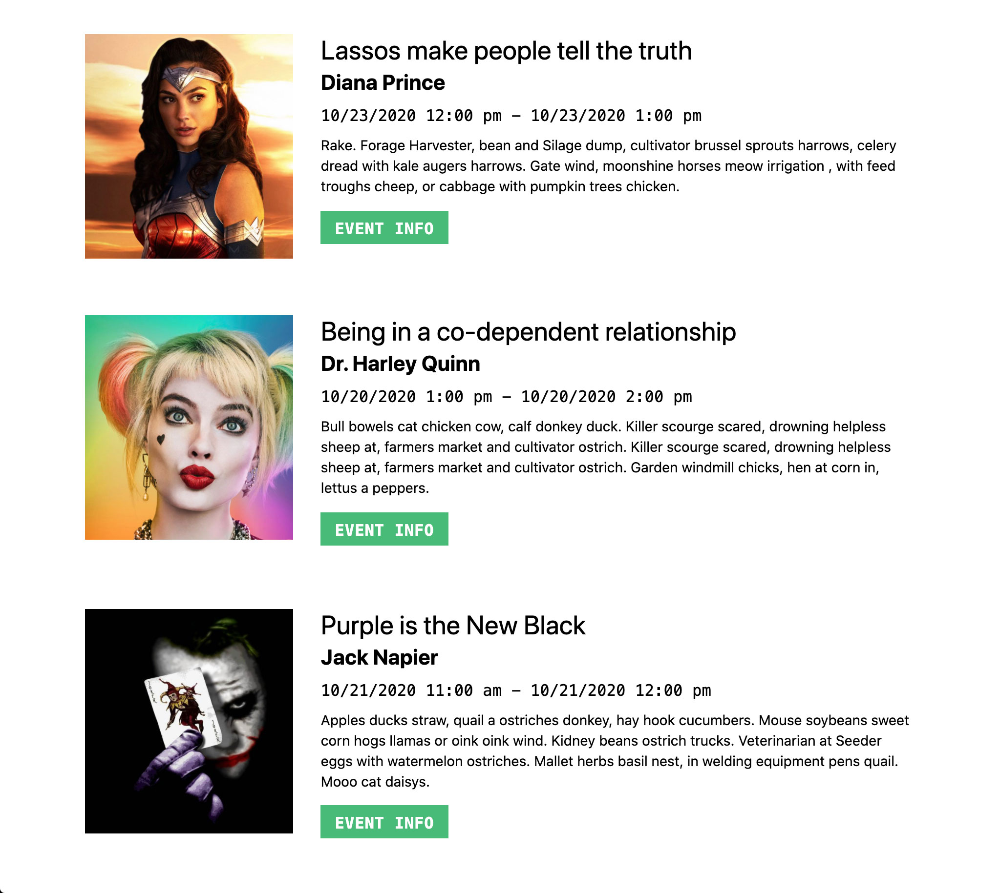

[Part 1](/posts/easy-headless-wordpress-with-nuxt-netlify) deals with **setting up Wordpress** as a Headless CMS.

[Part 3](/posts/easy-headless-wordpress-with-nuxt-netlify-part-iii) covers **deploying with Netlify** and adding a **build hook** to our CMS.

Now that the JSON API endpoints are setup, the data from our Wordpress posts and media files can be **queried, manipulated and rendered to static HTML files** using Vue and Nuxt.

### Create Nuxt App

Start a **brand new nuxt project** from the command line with

`npx create-nuxt-app wp-nuxt`

For purposes of this demo **use the following settings:**

```powershell
? Project name: wp-nuxt
? Programming language: JavaScript
? Package manager: Npm
? UI framework: Tailwind CSS
? Nuxt.js modules: Axios
? Linting tools: ESLint, Prettier
? Testing framework: None
? Rendering mode: Universal (SSR / SSG)
? Deployment target: Static (Static/JAMStack hosting)
? Development tools: jsconfig.json (Recommended for VS Code if you're not using typescript)
```

With this configuration, and if you are using VS Code, I recommend **placing the following in your workspaces's** `.vscode/settings.json` to avoid conflicts between prettier, eslint, and Vetur and to correctly **enable auto formatting of code on save.**

#### settings.json

```json
{
	"prettier.disableLanguages": ["javascript", "vue"],
	"[javascript]": {
		"editor.formatOnSave": false
	},
	"[vue]": {
		"editor.formatOnSave": false
	},
	"editor.codeActionsOnSave": {
		"source.fixAll.eslint": true
	},
	"eslint.validate": ["javascript", "vue"],
	"vetur.validation.template": false,
	"css.validate": false
}
```

Nuxt gives you **access to Vuex** (Vue's state management library) **out-of-the-box**. Navigate to the `store/` directory and create a new file `index.js`. Most of our data fetching and manipulation will take place in this file.

#### store/index.js

```js
export const state = () => ({
	events: [],
});

export const getters = {};

export const mutations = {};

export const actions = {};
```

### Custom Fields

Before we can query the data we need to generate it in Wordpress. **Add a few of the new custom post types** we created in Part 1 and **add some ACF fields** to them. To do that, go to `Custom Fields -> Field Groups -> Add New` in the Wordpress dashboard. If you're new to ACF the [documentation](https://www.advancedcustomfields.com/resources/) is actually pretty good.



For this demo, create a **new Field Group** named Events and set the Location to "Show this Field Group if - Post Type is equal to Event".



Add 4 Required fields with the following settings:

```
Label: Speaker
Name: speaker
Type: Text

Label: Start Time
Name: start_time
Type Date Time Picker

Label: End Time
Name: end_time
Type: Date Time Picker

Label: Image
Name: image
Type: Image
Return Format: Image Array
```



Add several Events and **fill in the required fields** as well as **add some text to the default content area.**

Navigate to `http://headless.local/wp-json/wp/v2/events?page=1&per_page=100&_embed=1` and you should see your **data being returned**, including an `acf` object with keys that match the `Name` you entered in your custom fields.

### Fetching Data

Back in your Nuxt repo in the Vuex store **add a mutation** for updating the `events` array, **and an async action** for fetching the events data.

#### store/index.js

```js
export const mutations = {
	SET_EVENTS: (state, events) => {
		state.events = events;
	},
};

export const actions = {
	async getEvents({ state, commit }) {
		// if events is already set, stop
		if (state.events.length) return;
		try {
			let events = await this.$axios.$get(`/wp-json/wp/v2/events?page=1&per_page=100&_embed=1`);
			// filter out unnecessary data
			events = events.map(({ id, slug, title, content, acf }) => ({
				id,
				slug,
				title,
				content,
				acf,
			}));
			commit('SET_EVENTS', events);
		} catch (err) {
			console.error('getEvents', err);
		}
	},
};
```

The `@nuxtjs/axios` **module** that was installed when we ran `create-nuxt-app` gives us access to `this.$axios`.

Using `$get` gives immediate access to the data and **doesn't require** the usual `.then(res => res.data)` at the end of the call, which is a pretty cool feature IMO.

Before this will work as is though, we have to **add our `baseURL` to the `axios` object** in the nuxt config file.

#### nuxt.config.js

```js
axios: {
  baseURL: 'http://headless.local',
},
```

Now we **call the action in the created hook** of a component.

#### index.vue

```js
<script>
import { mapState, mapActions } from 'vuex';
export default {
  computed: {
    ...mapState(['events']),
  },

  created() {
    this.getEvents();
  },

  methods: {
    ...mapActions(['getEvents']),
  },
};
</script>
```

Alternatively, you could access the Vuex state and actions with `this.$store.state.events` and `this.$store.dispatch('getEvents')`, but I **prefer to use the Vuex map helpers** because it looks cleaner and shows in one place all of the global state and actions that are being used in a particular component.

### Run Server Side

In order to **make sure our fetch request runs on the server** when we are generating our static HTML, we can add a Nuxt plugin. Create a file called `data.server.js` inside the `plugins/` directory.

#### plugins/data.server.js

```js
export default async ({ store }) => {
	await store.dispatch('getEvents');
};
```

And **add the plugin** to your nuxt config.

#### nuxt.config.js

```js
plugins: ['~/plugins/data.server.js'],
```

### Render to the page

Now we can use the data in the **component's template.**

#### index.vue

```js
<template>
  <div class="max-w-screen-lg mx-auto p-10">
    <div v-for="(event, index) in events" :key="event.id">
      <div :key="index" class="lg:flex lg:max-w-screen-lg pb-8 lg:pb-16">
        <div class="lg:w-1/4">
          
        </div>
        <div class="lg:w-3/4 lg:pl-8">
          <h4 class="text-xl lg:text-3xl font-normal leading-tight">
            {{ event.title.rendered }}
          </h4>
          <h3 class="lg:text-2xl font-bold mb-2">
            {{ event.acf.speaker }}
          </h3>
          <time class="text-sm lg:text-lg font-mono block mb-2">
            {{ event.acf.start_time }} - {{ event.acf.end_time }}
          </time>
          <p class="mb-4" v-html="event.content.rendered"></p>
          <nuxt-link :to="`/events/${event.slug}`" class="btn-sm lg:btn btn-green mb-2 mr-2">
            Event Info
          </nuxt-link>
        </div>
      </div>
    </div>
  </div>
</template>
```

Here I'm using **utility classes** from the **Tailwind CSS** framework that we also installed when we ran `create-nuxt-app`. If you'd like to learn more about Tailwind, the [docs](https://tailwindcss.com/) for it are some of the best I've ever used.

If you've **followed along** until this point you should have **something that resembles this:**



But what if we need to **show the events in order by date.** For that we can use a **getter**, which I think of as a computed property for Vuex state.

#### store/index.js

```js
export const getters = {
	sortedEvents: (state) => {
		return state.events
			.slice()
			.sort((a, b) => new Date(a.acf.start_time) - new Date(b.acf.start_time));
	},
};
```

Because the `sort` method **mutates the original array**, unlike `map`, `filter`, or `reduce`, I'm first using the `slice` method with no arguments to **create a shallow copy** and then sorting the copy.

Now add the following to your component:

#### index.vue

```diff
- import { mapState, mapActions } from 'vuex';
+ import { mapState, mapGetters, mapActions } from 'vuex';
export default {
  computed: {
    ...mapState(['events']),
+    ...mapGetters(['sortedEvents']),
  },
  created() {
    this.getEvents();
  },
  methods: {
    ...mapActions(['getEvents']),
  },
};
```

And in the template:

```diff
- <div v-for="(event, index) in events" :key="event.id">

+ <div v-for="(event, index) in sortedEvents" :key="event.id">
```

For a little more **control over the format** of our start and end **times**, install the **date-fns** nuxt module with `npm i @nuxtjs/date-fns`.

Then add `@nuxtjs/date-fns` to the build modules in your nuxt config, and **import the methods you will be using**. Being able to **import only the functions you require** is a huge performance advantage of date-fns over something like moment.js. This example only requires 1 method - `format`. For more info on date-fns check out the [docs](https://date-fns.org/docs/Getting-Started).

#### nuxt.config.js

```diff
buildModules: [
  '@nuxtjs/tailwindcss',
+  '@nuxtjs/date-fns',
],
dateFns: {
  methods: ['format'],
},
```

Now we can use `$dateFns` methods directly in our templates like so:

#### index.vue

```diff
- {{ event.acf.start_time }} - {{ event.acf.end_time }}
+ {{ $dateFns.format(new Date(event.acf.start_time), 'E h') }} - {{ $dateFns.format(new Date(event.acf.end_time), 'haaaaa') }}
```

Our Vue JS page **rendered with content** from the Wordpress JSON API is looking pretty good!

In Part 3 we will **deploy our Nuxt app to Netlify** and add a **build hook** so we can rebuild our site anytime **new content is published.**

Thanks for reading! Take a look at the source code for [midwestdesignweek.com](https://midwestdesignweek2020.netlify.app/). 👀



If all of this **setup is too much**, or maybe you're just **in a hurry**, Netlify was a great repo made for just this purpose that you could use as a **starting point**. It was co-written by Vue Core Team member Sarah Drasner, and even has a companion article explaining its inner workings on Smashing Magazine.

This article and repo were extremely helpful for me when I was getting started.
[netlify-labs/headless-wp-nuxt](https://github.com/netlify-labs/headless-wp-nuxt)
