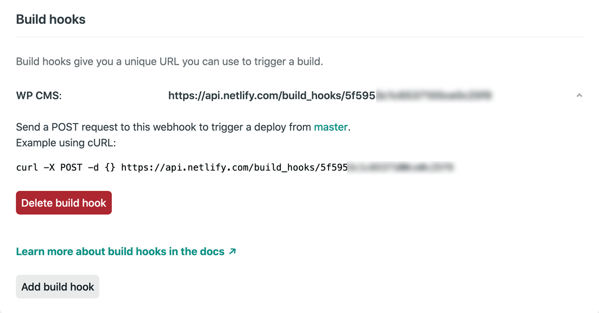
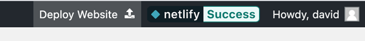
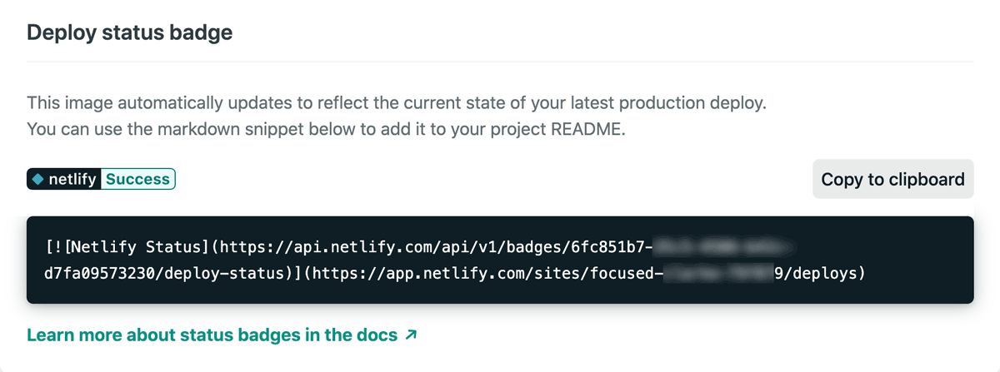

[Part 1](/posts/easy-headless-wordpress-with-nuxt-netlify) deals with **setting up Wordpress** as a Headless CMS.

[Part 2](/posts/easy-headless-wordpress-with-nuxt-netlify-part-ii) covers **Vue, Nuxt and Tailwind**.

Deploying your project to the web from a git repo is ridiculously easy using Netlify. I'm going to assume you are familiar with Github and have been committing your work from Parts 1 and 2 of this series.

Moving the **local Wordpress install** that we worked on in Part 1 **to a live URL** is outside the scope of this article, but I will say that I have had success using the pro version of [WP Migrate DB](https://wordpress.org/plugins/wp-migrate-db/). It is by no means the only option though.

Once your CMS is live you will need to **change the axios** `baseURL` in the Nuxt config.

```js
// nuxt.config.js

axios: {
  baseURL: 'http://yourlivesite.com',
},
```

## Add site in Netlify

Obviously you are also going to need a **Netlify account** for this, so if you don't have one, you will need to [create one](https://app.netlify.com/signup). **Sign up using your Github account** and you will be able to access your repos.

In the Netlify dashboard, click **New site from Git**.

Under Continuous deployment click the **Github** button.

Pick the correct **repo.**

If it's not set already, set the **Build Command** to `npm run generate`, and the **Publish directory** to `dist`.

Click **Deploy site**.

Netlify will deploy your site to a randomly generated URL that will end in `.netlify.app`. You have the ability to make your own custom `.netlify.app` URL or use a "real" domain name.

Any time you **push to this repo's master branch**, Netlify will **re-deploy the site for you**. But the whole point of **setting up a CMS** was so non-developers could **make changes and add content**. So we also want to **trigger a deploy** anytime new posts are **published** or existing published posts are **updated**.

## Generate Build Hook

Navigate to your new site in the Netlify dashboard and then to `Site Settings -> Build & deploy -> Build hooks` and click **Add build hook**. Give your build hook and name, and click **Save**.

Now we have access to a **unique URL** that we can use to **trigger a build**. If you click the dropdown arrow next to your build hook you, it will show you a **cURL command** that you can use to trigger a build **directly from the terminal.**



## Trigger Build Hook in Wordpress

Back in Wordpress, we can **hook into certain events** and **call the build hook**. I initially tried to set this up myself following the instructions outlined in this [article](https://dimitr.im/updating-gatsby-wordpress-published). It hooks into the `publish_post`, `publish_page` and `post_update` Wordpress hooks, and uses PHP's built in cURL library to trigger the build hook.

Sadly I could **not get that code to work reliably**. I'm not sure if it was permissions issues or very likely I was doing something wrong. Either way **I opted to use a plugin**, and I'm glad I did because it **offers several benefits which greatly improved the user experience** for the designers using the CMS.

The plugin is called [Jamstack Deployments](https://wordpress.org/plugins/wp-jamstack-deployments/).

Once installed, navigate to `Settings -> Deployments` and enter the the URL of your build hook. The plugin gives you the ability to choose via checkboxes which **Post Types**, **Taxonomies**, and **Post Statuses** will trigger a build.

For purposes of this demo, you should check `Events` under **Post Types** and `Published` under **Post Statuses**.

It's nice to be able to turn the settings on and off via the dashboard. But my **favorite feature** of this plugin is the **Status Bar** that it adds to the Wordpress dashboard.



To get the Status Bar working properly, **two URLs need to be added** in the Jamstack Deployments settings. The URLs can be found in your **Netlify dashboard** under `Site Settings -> General -> Deploy status badge`. The first URL that ends in `/deploy-status` is the **Badge Image URL** and the second URL that ends in `/deploys` is the **Badge Link**.



With those settings entered, the **current status** of your Netlify site is **displayed and updated in real-time** in the Wordpress Dashboard.

The status bar also has a **Deploy Website** button. I found this feature extremely useful as well. If you know you or someone will be **making a lot of updates** to the site at once, you can temporarily **turn off the auto-updates** and just hit the Deploy button when you are finished.

And that's it! Our **content-managed** website built with **Vue, and Wordpress** is live and content is **updating automatically.**

As always, **thanks for reading!**
