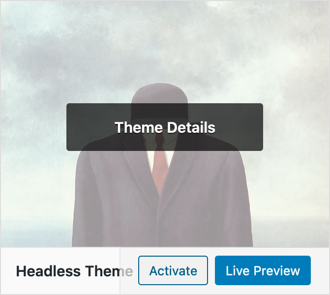
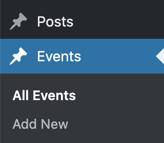

[Part 2](/posts/easy-headless-wordpress-with-nuxt-netlify-part-ii) covers Vue, Nuxt and a little Tailwind.

[Part 3](/posts/easy-headless-wordpress-with-nuxt-netlify-part-iii) will deal with deploying with Netlify and adding a build hook to our CMS.

Recently, I was tasked with building the **event website** for AIGA's first annual [Midwest Design Week](https://midwestdesignweek2020.netlify.app/).

Last year, I built the site for AIGA Louisville's Design Week using **Gatsby** and a handful of **markdown files**. The content was really only editable by myself or another developer, and that was fine at the time. (I wrote a couple articles about the experience [here](/posts/make-a-custom-night-mode-toggle-w-react-css-variables) and [here](/posts/make-a-flickering-neon-svg-animation-from-scratch-w-illustrator-react-emotion).

This year, however, members from 4 different city chapters were involved and needed to be able to **easily add and edit content**, so some kind of CMS was required.

The company I work for, [Relay Design Co.](https://relaydesign.co/) also got involved as the Creative Sponsor. Because the stacks we use at Relay include both **Vue JS and Wordpress**, I opted to try using Wordpress as a **headless CMS** and build the front-end with **Vue's Static Site Generator** Nuxt.

## Local Wordpress

The very first step is of course to **spin up a Wordpress site locally** so you can work on it. For this process I like to use [local by flywheel](https://localwp.com/). If you haven't tried it I highly recommend you do, because the entire process is literally **3 clicks and 3 text input fields**.

For this demo I'm assigning the site domain to `headless` and it will available at `headless.local`. Depending on what you use it may be `localhost:####`.

## Headless theme

Once your Wordpress site is up and running, navigate to `/wp-content/themes/` and **create a new folder** named `headlesstheme` (or whatever you'd like).

Inside of that folder **create the following files**:

### functions.php

```php
<?php

if (!defined('ABSPATH')) {
    exit;
} // Exit if accessed directly
```

### style.css

```css
/*
Theme Name: Headless Theme
Theme URI: https://github.com/username/reponame
Author: Your Name
Author URI: https://yoursite.com/
Description: headless theme for using WP as a REST API only
Version: 0.1.0
Requires at least: 4.7
Requires PHP: 5.6
License: GPLv2 or later
License URI: http://www.gnu.org/licenses/gpl-2.0.html
Text Domain: headlesstheme
*/
```

### index.php

```php
<script type="text/javascript">
  window.location = 'https://yourfrontend.com';
</script>
```

If you would prefer that visiting the url of this Wordpress site **not redirect** to your front-end app, leave the `index.php` **blank**.

To make your **theme look legit**, add 1 more file to the new theme folder - an 800x600 PNG image file - and name it `screenshot.png`. This image is what will show up in the dashboard under Themes.

At this point you are ready to **Activate your new theme**.



## 3rd party plugins

Next, we need to **install a few plugins** to make using Wordpress as a CMS a little more convenient.

### Classic Editor

Disables the new Gutenberg block editor.

### Advanced Custom Fields

How this plugin is not part of core Wordpress at this point is beyond me, but as the name implies it adds the ability to **add customized fields to posts, and pages**. Without it, we would be limited to the default title, text content and feature image fields.

### SVG Support

By default, the Wordpress Media Library doesn't allow SVG images because, since they are XML based, they could potentially pose a **security risk**. Just make sure anyone you give **editing privileges** to is someone **trustworthy** and it shouldn't be a problem.

If you prefer to avoid using a plugin, it is possible to enable SVG support just by add the following code to your `functions.php` file.

```php
function allow_svg($mimes)
{
    $mimes['svg'] = 'image/svg+xml';
    $mimes['svgz'] = 'image/svg+xml';
    return $mimes;
}
add_filter('upload_mimes', 'allow_svg');

function fix_mime_type_svg($data = null, $file = null, $filename = null, $mimes = null)
{
    $ext = isset($data['ext']) ? $data['ext'] : '';
    if (strlen($ext) < 1) {
        $exploded=explode('.', $filename);
        $ext=strtolower(end($exploded));
    }
    if ($ext==='svg') {
        $data['type']='image/svg+xml' ;
        $data['ext']='svg' ;
    } elseif ($ext==='svgz') {
        $data['type']='image/svg+xml' ;
        $data['ext']='svgz' ;
    }
    return $data;
}
add_filter('wp_check_filetype_and_ext', 'fix_mime_type_svg', 75, 4);
```

I usually try to **avoid using plugins and dependencies whenever possible**, but in this case I found that by using this snippet the SVGs would upload and display nicely on the front-end, but would **not display correctly in the Wordpress Dashboard**, and getting them to do so consistently was **more effort than it was worth**. For this reason, I choose to use the SVG Support plugin.

## JSON API

Out of the box, Wordpress gives you **2 default content types** - posts and pages. And the Wordpress JSON API gives you **endpoints** to easily access both of these content types.
`http://headless.local/wp-json/wp/v2/posts`
and
`http://headless.local/wp-json/wp/v2/pages`

Adding `?page=1&per_page=100&_embed=1` will return **all the available data**.

## Custom API plugin

**Additional content types** can be created and also queried using similar endpoints. The best place to **put your code** for creating these new post types is **in a plugin**.

To **create a custom plugin**, make a new folder inside `/wp-content/plugins/` and name it `headless-plugin` (or whatever you'd like).

Inside that folder create a php file with the **same name as your folder**:

### headless-plugin.php

```php
<?php
/*
Plugin Name: Headless Plugin
Description: Custom setup for JSON API
Author: Your Name
Version: 0.1.0
Text Domain: headless-plugin
License: GPLv2 or later
License URI: http://www.gnu.org/licenses/old-licenses/gpl-2.0.html
*/

if (!defined('ABSPATH')) {
    exit;
} // Exit if accessed directly

// ADD CODE FOR CUSTOM POST TYPES HERE
```

The following code will **create a post type named Events**:

```php
// create events post type
add_action('init', 'create_post_type_events');
function create_post_type_events()
{
    $labels = array(
    'name'               => _x('Events', 'post type general name', 'headless-plugin'),
    'singular_name'      => _x('Event', 'post type singular name', 'headless-plugin'),
    'menu_name'          => _x('Events', 'admin menu', 'headless-plugin'),
    'name_admin_bar'     => _x('Event', 'add new on admin bar', 'headless-plugin'),
    'add_new'            => _x('Add New', 'Event', 'headless-plugin'),
    'add_new_item'       => __('Add New Event', 'headless-plugin'),
    'new_item'           => __('New Event', 'headless-plugin'),
    'edit_item'          => __('Edit Event', 'headless-plugin'),
    'view_item'          => __('View Event', 'headless-plugin'),
    'all_items'          => __('All Events', 'headless-plugin'),
    'search_items'       => __('Search Events', 'headless-plugin'),
    'parent_item_colon'  => __('Parent Events:', 'headless-plugin'),
    'not_found'          => __('No Events found.', 'headless-plugin'),
    'not_found_in_trash' => __('No Events found in Trash.', 'headless-plugin')
  );

    $args = array(
    'labels'             => $labels,
    'description'        => __('Description.', 'headless-plugin'),
    'public'             => true,
    'publicly_queryable' => true,
    'show_ui'            => true,
    'show_in_menu'       => true,
    'query_var'          => true,
    'rewrite'            => array('slug' => 'event'),
    'capability_type'    => 'post',
    'has_archive'        => true,
    'hierarchical'       => false,
    'menu_position'      => 5,
    'show_in_rest'       => true,
    'rest_base'          => 'events',
    'rest_controller_class' => 'WP_REST_Posts_Controller',
    'supports'           => array('title', 'editor', 'custom-fields'),
  );

    register_post_type('events', $args);
}
```

Make sure to **use the same Text Domain** that you specified in the comment at the top of this file.



Now we can **query the Events** using this endpoint `http://headless.local/wp-json/wp/v2/events?page=1&per_page=100&_embed=1`

It is also possible to **create a custom endpoint** for your new post types. The code below with create an events endpoint that can be accessed at `http://headless.local/wp-json/mwdw/v1/events`.

```php
function events_endpoint($request_data)
{
    $args = array(
    'post_type' => 'events',
    'posts_per_page' => -1,
    'numberposts' => -1,
    'post_status' => 'publish',
  );
    $posts = get_posts($args);
    foreach ($posts as $key => $post) {
        $posts[$key]->acf = get_fields($post->ID);
    }
    return  $posts;
}
add_action('rest_api_init', function () {
    register_rest_route('mwdw/v1', '/events/', array(
    'methods' => 'GET',
    'callback' => 'events_endpoint'
  ));
});
```

Personally, I prefer to just work with the **default endpoints**.

## ACF

Since we will be using Advanced Custom Fields to add content we need to **add those fields to the data that is returned by the API**. We can write a function to add the endpoints and then call that function on the `rest_prepare_post_type` hook for each post type using `add_filter`.

```php
// add ACF object to default posts endpoint
add_filter('rest_prepare_post', 'acf_to_rest_api', 10, 3);
// adds ACF object to events endpoint
add_filter('rest_prepare_events', 'acf_to_rest_api', 10, 3);
function acf_to_rest_api($response, $post, $request)
{
    if (!function_exists('get_fields')) {
        return $response;
    }

    if (isset($post)) {
        $acf = get_fields($post->id);
        $response->data['acf'] = $acf;
    }
    return $response;
}
```

That's pretty much it for setting up Wordpress. In part 2 we will **query our data** from Vue/Nuxt and **setup auto deploys** using Netlify.

Check out the **source code** for my theme and plugin. 👀

[relaydesignco/mdmw-rest-plugin](https://github.com/relaydesignco/mdmw-rest-plugin)

[relaydesignco/wp-headless-theme](https://github.com/relaydesignco/wp-headless-theme)

Thanks for reading!
