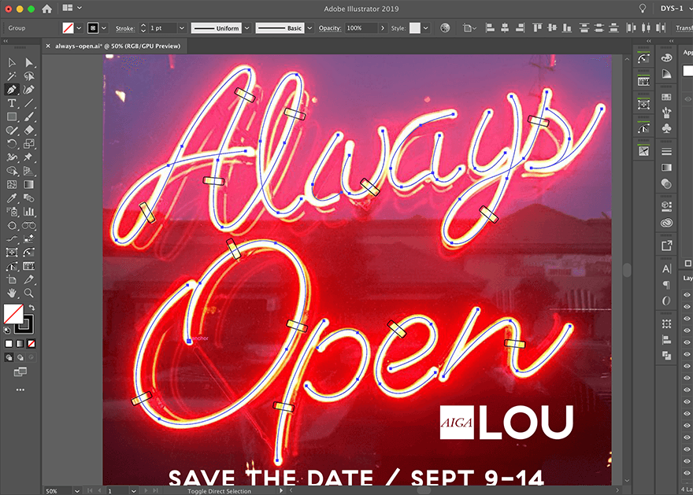
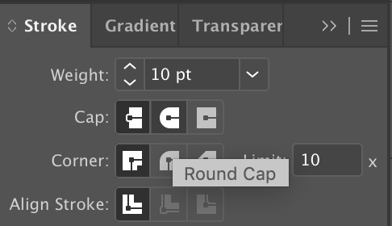
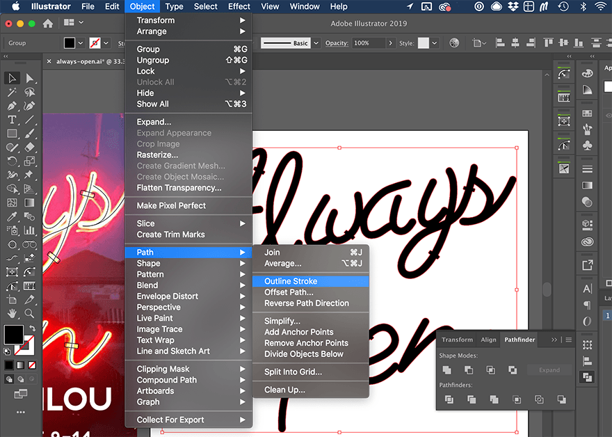
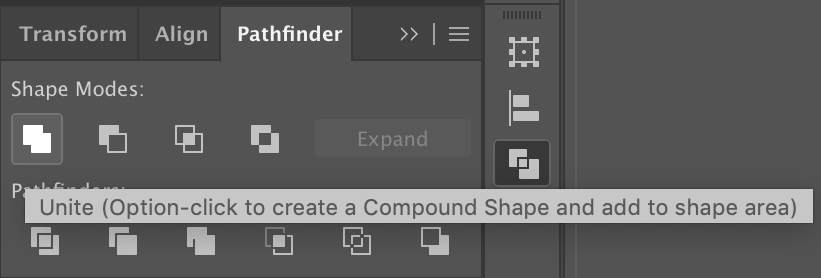
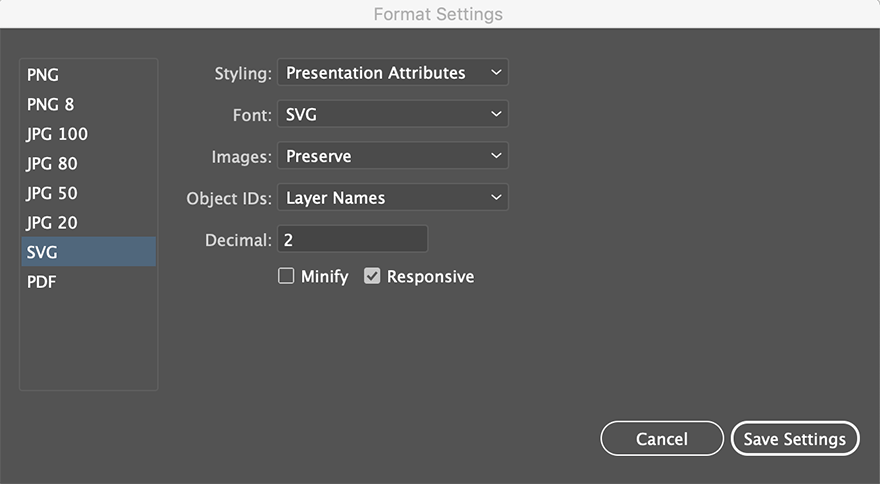
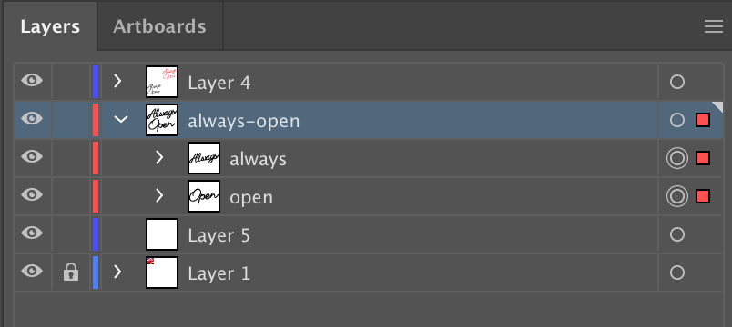
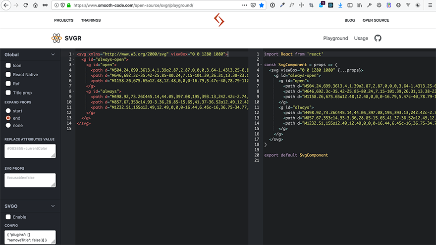
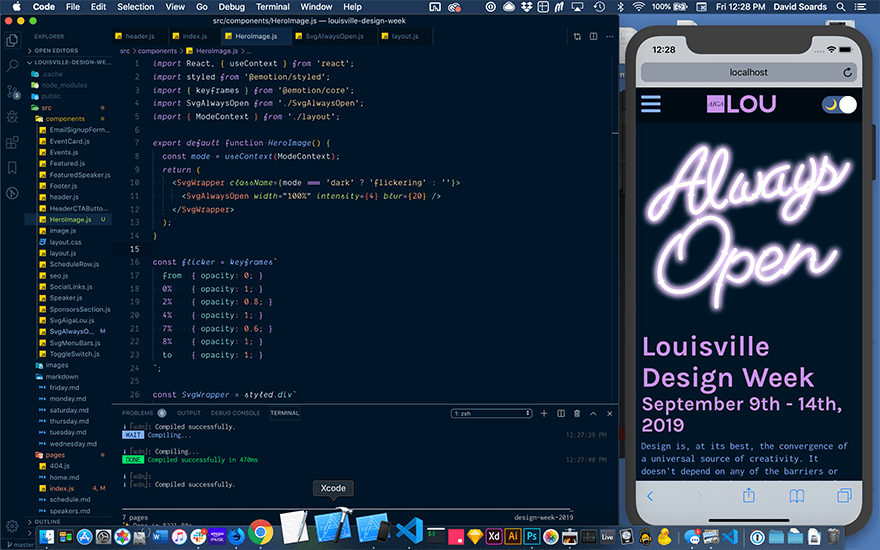

This is Part 2 in a short series where I am detailing the things I learned while designing and developing a website to promote AIGA Louisville's annual Design Week.

[louisvilledesignweek.com](https://louisvilledesignweek2019.netlify.app/)

Peep my [source code](https://github.com/davidysoards/louisville-design-week) 👀

[Part 1: Night Mode Toggle](/posts/make-a-custom-night-mode-toggle-w-react-css-variables)

## Create & Export the SVG

I started in **Adobe Illustrator** by tracing one of our promotional images for Design Week using the **pen tool** and added a few rounded rectangles for the brackets.



Then I dialed up the stroke value until it roughly matched the sign in the image and set the Cap to **Round Cap**.



I **outlined the strokes** with Object > Path > Outline Stroke



Then I united the overlapping elements into single shapes using the **Unite** Shape Mode in the **Pathfinder**.



I added a black fill and **exported the entire Artboard** as an SVG using the **Presentation Attributes** setting making sure to check **Responsive** (this gives you a viewBox instead of a fixed height and width).



How you organize the elements in your Illustrator file with **Layers** and **Groups** will also determine **how your exported code looks**.

I used a layer named "always-open" and two groups named "always" and "open". Exporting it as an **Artboard** instead of just a group of assets makes your **viewBox** a exact height and width of your choice and also provides your image with some padding.



The export produces the following code. (I've removed the actual numbers from the SVG paths because it made this article register as a "28 min read", but you can see them in the [source code](https://github.com/davidysoards/louisville-design-week/blob/master/src/components/SvgAlwaysOpen.js) on github.)

```xml
<svg xmlns="http://www.w3.org/2000/svg" viewBox="0 0 1280 1080">
  <title>
    always-open
  </title>
  <g id="always-open">
    <g id="open">
      <path d="######"/>
      <path d="######"/>
      <path d="######"/>
    </g>
    <g id="always">
      <path d="######"/>
      <path d="######"/>
      <path d="######"/>
    </g>
  </g>
</svg>
```

I used to always run any SVG I exported through [SVGOMG](https://jakearchibald.github.io/svgomg/) but according to people much smarter than myself, Illustrator's export has gotten so good that this is no longer really necessary.

<blockquote class="twitter-tweet"><p lang="en" dir="ltr">This. The <a href="https://twitter.com/Illustrator?ref_src=twsrc%5Etfw">@Illustrator</a> SVG Export is so clean I never use SVGO anymore when I’m dealing with SVGs exported from it. <a href="https://t.co/1uDRpMBxqh">https://t.co/1uDRpMBxqh</a></p>&mdash; Sara Soueidan (@SaraSoueidan) <a href="https://twitter.com/SaraSoueidan/status/1167807788707450880?ref_src=twsrc%5Etfw">August 31, 2019</a></blockquote> <script async src="https://platform.twitter.com/widgets.js" charset="utf-8"></script>

Sara _really_ knows her stuff when it comes to SVG (and a11y). If this is a subject your are interested learning more about I _highly_ recommend any of her [writing](https://www.sarasoueidan.com/blog/) or talks. Dmitry is one of the wizards who engineered the new SVG export function!

To convert my SVG to a React component, I used another online tool called [SVGR Playground](https://www.smooth-code.com/open-source/svgr/playground/). Just paste your SVG code into the left side of the tool and it creates a function component for you.



The new **SVG React component** looks like this:

```jsx
import React from 'react';

const SvgAlwaysOpen = (props) => (
	<svg viewBox="0 0 1280 1080" {...props}>
		<g id="always-open">
			<g id="open">
				<path d="######" />
				<path d="######" />
				<path d="######" />
			</g>
			<g id="always">
				<path d="######" />
				<path d="######" />
				<path d="######" />
			</g>
		</g>
	</svg>
);

export default SvgAlwaysOpen;
```

## Customizing the SVG Component

This effect uses two **SVG filters**. One is the **drop shadow** for the **light mode** and the other is the **glow** for the **dark mode**. Filters need to be defined inside the **\<defs\> element**.

What is the defs element? I'll let Sara Soueidan explain:

_The \<defs\> element is used to define elements that you want to reuse later. Defining elements with \<defs\> is useful for when you want to create sort of a “template” that you want to use multiple times throughout the document. Elements defined inside a \<defs\> element are not rendered on the canvas except if you “call” them somewhere in the document._

```xml
<defs>
  <filter id="glow" x="-50%" y="-50%" width="200%" height="200%">
    <feGaussianBlur
      result="blurred"
      in="SourceGraphic"
      stdDeviation={blur}
    />
  </filter>

  <filter id="shadow" x="0" y="0" width="200%" height="200%">
    <feOffset result="offOut" in="SourceAlpha" dx="20" dy="20" />
    <feColorMatrix
      result="matrixOut"
      in="offOut"
      type="matrix"
      values="1 0 0 0 0
              0 1 0 0 0
              0 0 1 0.05 0
              0 0 0 0.2 0"
    />
    <feGaussianBlur result="blurOut" in="matrixOut" stdDeviation="10" />
  </filter>
</defs>
```

In order to reuse the paths multiple times but assign different filters, fills and transitions to them as needed, I place them inside the **\<defs\> element** as well and then call them by their id inside **\<use\> elements**. The fills are assigned to CSS variables and the colors will change upon clicking the toggle switch in the header. The length of the **transitions** and the **ease** values are set by the **style attributes**. The setup for the variables and the dark mode switch is described in [part 1](/posts/make-a-custom-night-mode-toggle-w-react-css-variables) of this series.

```jsx
<use xlinkHref="#always-open" filter="url(#shadow)" />
<use
  xlinkHref="#always-open"
  fill="var(--color-neon-glow)"
  filter="url(#glow)"
  style={{
    transition: 'fill 0.5s ease-in',
  }}
/>
<use
  xlinkHref="#always-open"
  fill="var(--color-neon-fill)"
  style={{
    transition: 'fill 0.3s ease-in',
  }}
/>
```

To control the glow effect, I'm using a function I found in a [CodePen](https://codepen.io/clickblipclick/pen/zdpMgY) by Ben Nyberg. With this function I can pass in an intensity value via props that will increase or decrease the glow effect.

```javascript
function addIntensity(num) {
	const arr = [];
	while (num) {
		arr.push(<feMergeNode in="blurred" key={num} />);
		num--;
	}
	return arr;
}
```

_The \<feMerge\> SVG element allows filter effects to be applied concurrently instead of sequentially._ - [MDN](https://developer.mozilla.org/en-US/docs/Web/SVG/Element/feMerge)

The **addIntenstiy function** takes the intensity value passed via props and adds that many blur filters inside the **\<feMerge\> element**. I settled on an **intensity of 4** which means I have a blur filter on top of a blur filter on top of a blur filter on top of a blur filter, creating an **extreme blur**.

```diff
  <feGaussianBlur
    result="blurred"
    in="SourceGraphic"
    stdDeviation={blur}
  />
+  <feMerge>{addIntensity(intensity)}</feMerge>
```

I'm also passing in a **width** prop and a **blur** prop is used to set the **stdDeviation** of the feGaussianBlur effect. **\<feGaussianBlur\>** is a native SVG filter primitive. If you are interested in learning more about SVG filters check out this series on [codrops](https://tympanus.net/codrops/2019/01/15/svg-filters-101/).

```jsx
//SvgAlwaysOpen.js
const SvgAlwaysOpen = ({ width, intensity, blur }) => (
  <svg viewBox="0 0 1280 1080" width={width}>
  {/* ... */}
)

```

```jsx
// in Parent Component
<SvgAlwaysOpen width="100%" intensity={4} blur={20} />
```

## Making it Flicker

The flicker animation is a simple **CSS keyframes** animation on the opacity value. The same set of keyframes is used for both **flicker1** and **flicker2**. The difference between the two is their **duration** and that flicker2 is **delayed by 3s** before it starts. Both are set to **linear** (no easing) and **infinte**, which means the animation will play on a **loop continuously**. I used the **keyframes** helper from **@emotion/core** to set the CSS keyframes from inside my JS file.

```jsx
//SvgAlwaysOpen.js
import styled from '@emotion/styled';
import { keyframes } from '@emotion/core';

// ...

// right under the function component
const flicker = keyframes`
  from  { opacity: 0; }
  0%    { opacity: 1; }
  3%    { opacity: 0.4; }
  6%    { opacity: 1; }
  7%    { opacity: 0.4; }
  8%    { opacity: 1; }
  9%    { opacity: 0.4; }
  10%   { opacity: 1; }
  89%   { opacity: 1; }
  90%   { opacity: 0.4; }
  100%  { opacity: 0.4; }
  to    { opacity: 1; }
`;

const AlwaysOpen = styled.g`
	.flicker1 {
		animation: ${flicker} 5s linear infinite;
	}
	.flicker2 {
		animation: ${flicker} 6s linear 3s infinite;
	}
`;
```

The styles are applied to the SVG component via the **@emotion/styled** library in the same way you would apply them to any other JSX HTML element. In this case the **\<g\>** tag with id="always-open" has been renamed to **\<AlwaysOpen\>** and the **classNames** 'flicker1' and 'flicker2' will be **applied to specific paths** inside the AlwaysOpen group.

```diff
- <g id="always-open">
+ <AlwaysOpen id="always-open">
   <g id="open">
     <path d="######" />
     <path
+      className={mode === 'dark' ? 'flicker1' : ''}
       d="######"
     />
     <path d="######" />
   </g>
   <g id="always">
     <path
+      className={mode === 'dark' ? 'flicker2' : ''}
       d="######"
     />
     <path d="######" />
     <path d="######" />
   </g>
- </g>
+ </AlwaysOpen>
```

The **conditional logic** for the classNames prevents the animations from playing unless the mode is set to 'dark'. The **currentMode** variable is located in layout.js which is **4 levels up** from the SvgAlwaysOpen component.

In order to **access the currentMode variable** from inside the SVG compenent I used React's **Context** API.

```jsx
// layout.js
import React, { useState, useEffect, createContext } from 'react';

// ...

export const ModeContext = createContext('light');

export default function Layout({ children }) {
	const [currentMode, setCurrentMode] = useState('light');

	// ...

	return (
		<>
			<ModeContext.Provider value={currentMode}>
				<Header />
				<main>{children}</main>
				<Footer />
			</ModeContext.Provider>
		</>
	);
}
```

```jsx
// SvgAlwaysOpen.js
import React, { useContext } from 'react';
import { ModeContext } from './layout';

// ...

export default function SvgAlwaysOpen({ width, intensity, blur }) {
	const mode = useContext(ModeContext);

	// ...
}
```

Context is fairly new to React and **replaces the need for Redux** in most cases. You can read more about it in the [React docs](https://reactjs.org/docs/context.html)

## WTF iOS?!

The final issue I had to deal with was that the animations applied inside the SVG **don't seem to work on iOS**. They work on all modern desktop browsers and even on Android phones but not iPhones.

I used the **Simulator** app on my Macbook to create a workaround for this issue without having to actually deploy to the web repeatedly in order to check it on my phone. Very convenient.



The solution I came up with was to create a **wrapper component** and add an additional animation to it. Adding the animation directly to a wrapper div inside index.js didn't work either because there is an open issue with updating Context variables inside Gatsby page templates. 🤷🏻‍♂️

The new flicker is **more subtle and affects the entire SVG** not just certain letters. I think it works both by itself and in combination with the other 2 animations. The keyframes are similar but slightly different, and the **duration is 10 seconds** with a initial **delay of 5 seconds**.

```jsx
// HeroImage.js
import React, { useContext } from 'react';
import styled from '@emotion/styled';
import { keyframes } from '@emotion/core';
import SvgAlwaysOpen from './SvgAlwaysOpen';
import { ModeContext } from './layout';

export default function HeroImage() {
	const mode = useContext(ModeContext);
	return (
		<SvgWrapper className={mode === 'dark' ? 'flickering' : ''}>
			<SvgAlwaysOpen width="100%" intensity={4} blur={20} />
		</SvgWrapper>
	);
}

const flicker = keyframes`
  from  { opacity: 0; }
  0%    { opacity: 1; }
  2%    { opacity: 0.8; }
  4%    { opacity: 1; }
  7%    { opacity: 0.6; }
  8%    { opacity: 1; }
  to    { opacity: 1; }
`;

const SvgWrapper = styled.div`
	max-width: 540px;
	width: 100%;
	margin: 20px auto;
	@media screen and (min-width: 1024px) {
		margin: 40px auto;
		flex-shrink: 0;
	}
	&.flickering {
		animation: ${flicker} 10s linear 5s infinite;
	}
`;
```

And that's it! Thanks for reading!
