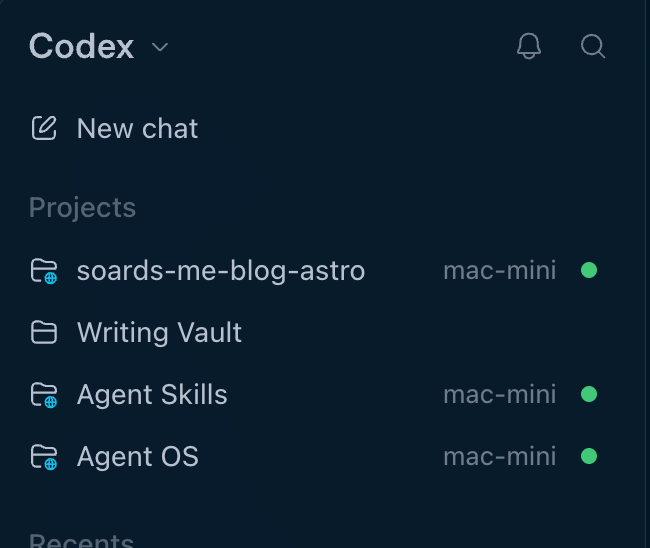

I wanted to **stop running development code and scripts on the same machine that holds my personal information**. My MacBook has my iCloud data, personal files, and browser sessions. Giving coding agents access to that environment was making me increasingly uncomfortable.

Agents add to the concern, but ordinary development already involves running plenty of other people's code. Supply chain attacks involving JavaScript and Python packages worry me whether I'm installing a dependency myself or letting an agent do it. The recent <a href="https://www.sonatype.com/blog/open-source-malware-index-q4-2025-automation-overwhelms-ecosystems" target="_blank" rel="noopener">surge in malicious open-source packages</a>, particularly on npm, has made that concern harder to ignore.

So I moved development onto a dedicated Mac mini and kept the MacBook as the client. I also wanted one place for my repositories and tooling, instead of maintaining development environments across multiple Macs.

Using containers or VMs is more secure, but I find them a PITA to work in all the time. A dedicated machine is simpler and more pleasant for everyday work, with enough reduction in exposure to make it worthwhile.

## A separate development account

The Mini has a standard user account named `dev`, with its own home directory. It's not connected to iCloud. It's not signed into my browser profile. It has no access to my personal files or passwords. I keep the administrator account separate and use admin credentials explicitly when something needs elevated permissions.

Switching between the admin and development accounts during setup was slightly annoying at first. But I wanted routine development to happen as a standard user, so it was a necessary inconvenience.

The basic arrangement is:

```text
MacBook                              Mac mini
  Zed                                  dev account
  Ghostty + Herdr      SSH over           repositories
  Codex Desktop  ──── Tailscale ────>     development tools
                                         agent sessions
                                         development credentials
```

The clients run on the MacBook. The development environment lives on the Mini.

## Tailscale for the network, OpenSSH for access

I use Tailscale to provide a private network path between the two machines. **Tailscale provides the network; standard OpenSSH provides the remote-access layer.**

I deliberately chose normal SSH rather than Tailscale SSH because I already understand and trust the macOS/OpenSSH model. I can use ordinary Unix users and SSH keys, with `authorized_keys` on the server and `~/.ssh/config` on the client. Tailscale documents this <a href="https://tailscale.com/docs/reference/ssh-over-tailscale" target="_blank" rel="noopener">standard SSH arrangement</a> separately from its own SSH authentication feature.

On the Mini, I enabled macOS Remote Login for the `dev` user and added an Ed25519 public key from the MacBook to that account's `~/.ssh/authorized_keys`. Remote Login lets you <a href="https://support.apple.com/guide/mac-help/allow-a-remote-computer-to-access-your-mac-mchlp1066/mac" target="_blank" rel="noopener">restrict access to selected users only</a>.

Here's the entry in the MacBook's `~/.ssh/config`.

```text
Host mac-mini
    HostName <mac-mini-tailscale-hostname>
    User dev
    IdentityFile ~/.ssh/<dev-key>
    IdentitiesOnly yes
```

`mac-mini` is an SSH alias. I don't have to remember the Mini's actual network hostname. I can use the alias instead like so:

```sh
ssh mac-mini
```

Zed and Codex Desktop can use the same SSH target after their remote connections are set up. If I switch away from Tailscale later, I'll need another network path, but I can keep the ordinary SSH setup.

## Sharing only the credentials I need

I set up a 1Password guest account for use in the development account and share only the passwords it needs. The <a href="https://support.1password.com/guests/" target="_blank" rel="noopener">guest-sharing feature</a> lets me limit access to a selected vault instead of bringing my full personal password manager into the environment.

I also use Secure Notes to pass temporary text into the development account, including API keys, SSH keys, passwords, or whatever other text I need there.

Not having my full password manager available can be frustrating. It means an extra step when I need something I haven't shared yet. But copying all my personal secrets over would defeat the purpose of this setup. **Credentials are scoped to the development work that needs them**.

I also cleaned up GitHub authentication. Instead of exporting a global `GH_TOKEN`, I use:

```sh
gh auth login
```

By default, <a href="https://cli.github.com/manual/gh_auth_login" target="_blank" rel="noopener">`gh auth login`</a> uses a browser login and stores the token in the system credential store.

## An authentication problem that was actually networking

During setup, running `gh auth status` inside Codex made it look like my GitHub credential was invalid. The fix was to enable networking in the `workspace-write` sandbox.

```toml
sandbox_mode = "workspace-write"

[sandbox_workspace_write]
network_access = true
```

This gives sandboxed commands network access. I was comfortable allowing it for my work on the Mini, while keeping the filesystem restrictions. The credential was valid once the command could reach GitHub.

## Herdr and closing the laptop

I use <a href="https://github.com/motionharvest/herdr" target="_blank" rel="noopener">Herdr</a> to manage CLI agents in the terminal. At first I used a normal SSH session to the Mini and launched Herdr inside it.

```sh
ssh mac-mini
herdr
```

That worked until I closed the MacBook or let it sleep long enough for the connection to break. I'd come back to `Broken pipe`, sometimes with raw mouse-control escape sequences appearing in Ghostty and the terminal left in a mangled state.

A better approach is to run Herdr directly on the MacBook with the `--remote` flag.

```sh
herdr --remote mac-mini
```

In <a href="https://herdr.dev/docs/persistence-remote/" target="_blank" rel="noopener">Herdr's remote mode</a>, the local client draws the interface while the remote server owns the running panes and sessions. It just needs working SSH access and a compatible Herdr installation on the host.

I can close the MacBook with several agents working, then run the same command later to reconnect to the existing work. **The agents can continue while the laptop is closed** because they're running on the Mini.

That has made the terminal workflow much more comfortable. I can disconnect the client without treating it as the end of the work session.

## Zed makes remote editing practical

Being able to open and edit files as easily as if they were on my local filesystem is a must-have for me. If connecting to the Mini were a chore every time I wanted to change a file, I wouldn't stick with this setup.

VS Code offers remote editing, but in my experience it was slower and flakier. I had to reconnect frequently, and reconnecting was slow enough to be annoying.

**Connecting and reconnecting with Zed is super fast.** I usually only need to reconnect after the laptop goes to sleep.

<a href="https://zed.dev/docs/remote-development" target="_blank" rel="noopener">Zed's remote development</a> uses the local SSH client and inherits the matching settings from `~/.ssh/config`. In its Remote Projects dialog, I can use `ssh mac-mini` as the connection command, then choose the project directory on the Mini. Zed runs its interface locally, while the remote server handles things like language servers and terminal commands.

## One environment, a few familiar clients

The maintenance benefit is straightforward. My repositories, runtimes, and package managers are on one machine. So are the agent tools and their instructions, skills, and hooks. When I change that environment, the next client connection reaches the same setup. **I don't have to repeat the development-tool changes on the laptop.**

Codex Desktop has also become a bigger part of my workflow. It supports <a href="https://learn.chatgpt.com/docs/remote-connections#connect-to-an-ssh-host" target="_blank" rel="noopener">projects over SSH</a>, using the same `mac-mini` alias. I love having local and remote projects together in the sidebar, with the remote entries identified by the host name and a different folder icon. Working in those remote projects feels almost no different from working locally. I expected to stay mostly with CLI agents, but Desktop has been so easy to work with that I've found myself using it more.



I now do all my development on the Mini, using Zed for file editing, Codex Desktop, and Ghostty with Herdr for Codex and pi CLI agents. I've even uninstalled the Codex CLI from my MacBook.
