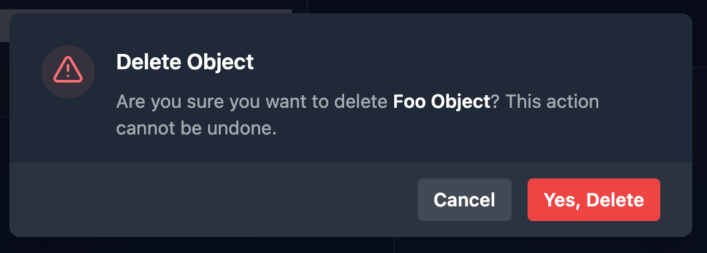

VueJS is my front-end framework of choice. I use it at work and on various side projects. I love Vue's opt-in style reactivity engine (as opposed to React's opt-out style), but on occasion I find myself needing to purposely **break the reactivity of a value**.

One such situation that I have run into on multiple occasions recently is when using a confirmation dialog. It's a good practice when deleting an object through a UI, to not immediately perform the delete on the initial click, but to first **confirm the destructive action** with the user. That's because **preventing errors** is better than helping users recover from them. This principle is #5: Error Prevention on Jakob Nielson's [10 Usability Heuristics for User Interface Design](https://www.nngroup.com/articles/ten-usability-heuristics/)

Let's say I have an object from a list selected and I click Delete. To confirm this action, I show a dialog that display's the selected object's name along with a question asking if the user is sure they want to delete it.



To accomplish this, I save the selected object to a `ref` called `selectedObj` and I use `selectedObj.value.name` in the text of the confirmation.

If the user clicks "Yes, Delete", we fire off a delete request, reset `selectedObj` to `undefined`, and close the dialog.

But because `selectedObj` is a reactive ref, as the dialog is fading out the **name will disappear** and the remaining text will shift suddenly, which is a **pretty janky UX**.

```ts
const selectedObj = ref();
const isConfirmOpen = ref(false);

async function deleteObject() {
  if (selectedObj.value?.id === undefined) return;
  await http.delete(`/api/item/${selectedObj.value.id}`);
  selectedObj.value = undefined;
  isConfirmOpen.value = false;
}
```

The simple solution is to **make a non-reactive copy** of the name before opening the dialog. Since the name value is a string, we can just copy it to a `let` and use that in the dialog's text.

```ts
let confirmDisplayName = '';

function handleDeleteObject() {
  // make a copy of the preset name before opening the confirm modal
  confirmObjName = selectedObj.value?.name ?? '';
  isConfirmOpen.value = true;
}
```

```html
<!-- button with click handler -->

<button type="button" @click="handleDeleteObject">Delete Object</button>
```

```html
<!-- modal component -->

<DModal v-model:open="isConfirmOpen" @confirm="deleteObject">
  <p>
    Are you sure you want to delete
    <span class="font-semibold">{{ confirmObjName }}</span>? This action cannot be undone.
  </p>
</DModal>
```

If we needed to break reactivity of the entire `selectedObj` we could copy it using Vue's `toRaw` method.

```ts
selectedObjCopy = toRaw(selectedObj.value);
```

However, this is not necessary if all we are copying is a primitive value like a string.

Now when I set `selectedObj` to `undefined` after sending the delete request, **the name of the object will no longer disappear** before the dialog closes.
