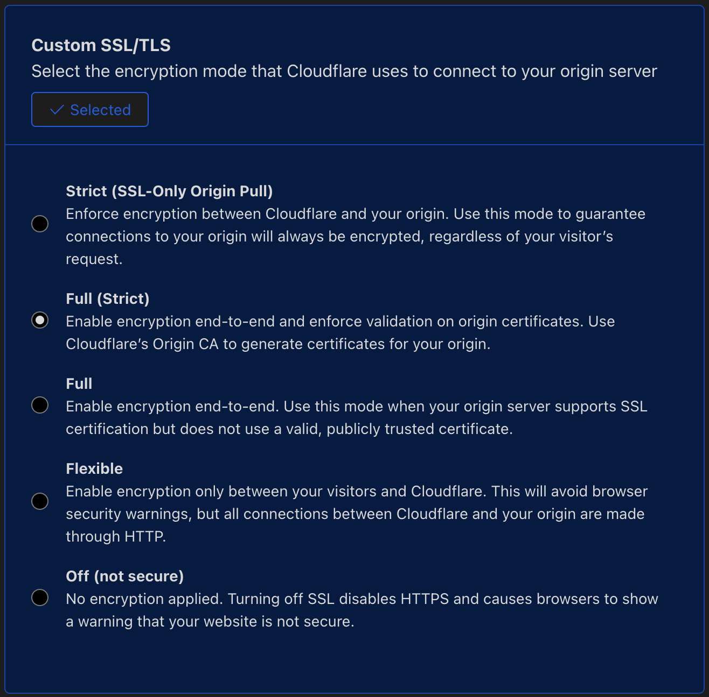
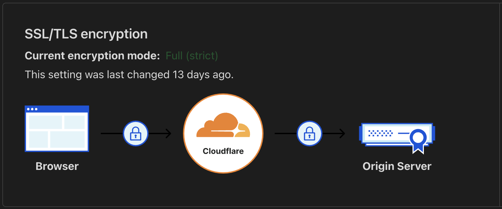

I switched the reverse proxy on my Ubuntu server from NGINX to **Caddy** and it really simplified things.
Below are the steps I took:

## Install Caddy

```sh
sudo apt install -y debian-keyring debian-archive-keyring apt-transport-https curl
curl -1sLf 'https://dl.cloudsmith.io/public/caddy/stable/gpg.key' | sudo gpg --dearmor -o /usr/share/keyrings/caddy-stable-archive-keyring.gpg
curl -1sLf 'https://dl.cloudsmith.io/public/caddy/stable/debian.deb.txt' | sudo tee /etc/apt/sources.list.d/caddy-stable.list
sudo apt update
sudo apt install caddy
```

## Check that the install worked

```sh
sudo service caddy status
```

If NGINX is installed, you'll probably see an error that port 80 is already in use at first.

I replaced all the individual files in `conf.d` with a single **Caddyfile**. It's also possible to use the `sites-available` / `sites-enabled` pattern, but I don't see the benefit.

## Before

```nginx
# root.conf

server {
        listen 80 default_server;
        listen [::]:80 default_server;
        server_name _;
        location / {
                return 404;
        }
}
```

```nginx
# website1.conf

server {
    listen 80;
    listen [::]:80;
    server_name website1.com;

    location / {
        proxy_pass http://localhost:8080;
        proxy_set_header Host $host;
        proxy_set_header X-Real-IP $remote_addr;
        proxy_set_header X-Forwarded-For $proxy_add_x_forwarded_for;
        proxy_http_version 1.1;
        proxy_set_header Upgrade $http_upgrade;
        proxy_set_header Connection 'upgrade';
        proxy_cache_bypass $http_upgrade;
    }

    location /api {
        proxy_pass http://localhost:3000;
        proxy_set_header Host $host;
        proxy_set_header X-Real-IP $remote_addr;
        proxy_set_header X-Forwarded-For $proxy_add_x_forwarded_for;
        proxy_http_version 1.1;
        proxy_set_header Upgrade $http_upgrade;
        proxy_set_header Connection 'upgrade';
        proxy_cache_bypass $http_upgrade;
    }

    location /auth {
        proxy_pass http://localhost:3000;
        proxy_set_header Host $host;
        proxy_set_header X-Real-IP $remote_addr;
        proxy_set_header X-Forwarded-For $proxy_add_x_forwarded_for;
        proxy_http_version 1.1;
        proxy_set_header Upgrade $http_upgrade;
        proxy_set_header Connection 'upgrade';
        proxy_cache_bypass $http_upgrade;
    }

}
```

```nginx
# website2.conf

server {
    listen 80;
    listen [::]:80;
    server_name website2.com;

    location / {
        proxy_pass http://localhost:8081;
        proxy_set_header Host $host;
        proxy_set_header X-Real-IP $remote_addr;
        proxy_set_header X-Forwarded-For $proxy_add_x_forwarded_for;
        proxy_http_version 1.1;
        proxy_set_header Upgrade $http_upgrade;
        proxy_set_header Connection 'upgrade';
        proxy_cache_bypass $http_upgrade;
        auth_basic "Restricted Content";
        auth_basic_user_file /etc/nginx/.htpasswd;
    }

    location /api {
        proxy_pass http://localhost:3001;
        proxy_set_header Host $host;
        proxy_set_header X-Real-IP $remote_addr;
        proxy_set_header X-Forwarded-For $proxy_add_x_forwarded_for;
        proxy_http_version 1.1;
        proxy_set_header Upgrade $http_upgrade;
        proxy_set_header Connection 'upgrade';
        proxy_cache_bypass $http_upgrade;
    }
}
```

## After

```sh
sudo nano /etc/caddy/Caddyfile
```

```
# Caddyfile

rootdomain.com {
        respond 404
}

0.000.00.000:80 {
        redir https://rootdomain.com{uri}
}


# site 1

website1.com {
        reverse_proxy :8080
        reverse_proxy /api/* :3000
        reverse_proxy /auth/* :3000
}


# site 2

website2.com {
        reverse_proxy :8081
        reverse_proxy /api/* :3001
        basic_auth {
                username $hashed$.password4321
        }
}
```

Not bad, eh?

## Restart Caddy

```sh
sudo systemctl reload caddy
```

## Fix SSL Config

I'm using Cloudflare for DNS which turns on their proxy by default. After updating to Caddy with it's **built in SSL** (an amazing feature btw), I got an `ERR_TOO_MANY_REDIRECTS` error in the browser. The solution was to change Cloudflare's SSL Config to **"Full (Strict)"**. The problem seems to be fairly common and I found the answer [here](https://caddy.community/t/caddy-cloudflare-err-too-many-redirects/3518) on the Caddy Community site.

Navigate to **Websites** in the sidebar > choose the site.
Then choose **SSL/TLS** in the sidebar > click Configure.
Under **Custom SSL/TLS** > select **Full (Strict)**.




## Remove NGINX

```zsh
sudo apt remove nginx
sudo apt-get remove --purge nginx*

# maybe
sudo rm -rf /etc/nginx
sudo rm -rf /etc/init.d/nginx
sudo rm -rf /var/log/nginx
sudo rm -rf /var/cache/nginx/
sudo rm -rf /usr/sbin/nginx
```

Thanks for reading! 👋
